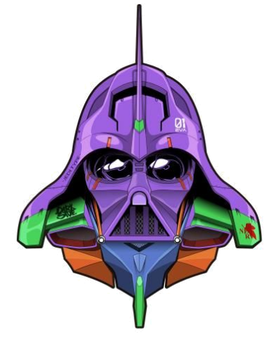
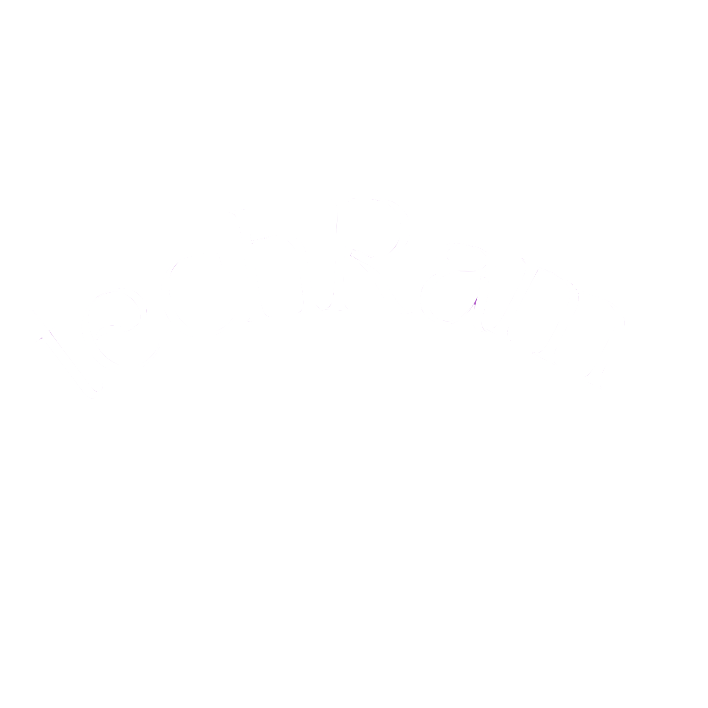

# techRam

## Nuestro sitio

Nuestro e-commerce ofrece diversos productos de tecnología (componentes de pc, periféricos, laptops). 
Tambien ofreceremos sillas gamer y escritorios para el setup de la pc.
Apuntamos a un publico que conozca y use computadoras (ya sea para jugar o trabajar) y tambien al que no,
ya que ofrecemos ayuda para armar una pc según las necesidades del cliente.

## Integrantes del proyecto

**Brian Garcia**
- 24 años
- Estudiante de programación web Full Stack e Licenciatura en Informática

**Micaela Sosa**
- 27 años
- Estudiante de programación web Full Stack, amante de los gatos, dibujante digital

**Santiago Leiva**
- 20 años
- Estudiante de programación web Full Stack e ingeniería en informática y facturador en mayorista

**Marité Mena**
- 19 años
- Estudiante de programación web Full Stack, apasionada por la cocina y bascket

**Ricardo Jose Juturi**
- 20 años 
- Estudiante de programación web Full Stack, ciclista y dibujante

## Sitios de referencia:

Elegimos estas paginas debido a que algunas son pioneras en lo relacionado a venta de productos tecnologicos, y otras tienen una estetica agradable a la vista y es lo que queremos lograr con nuestro e-commerce. 
- [Maximus](https://www.maximus.com.ar/)
- [Compragamer](https://compragamer.com/)
- [Gezatek](https://www.gezatek.com.ar/)
- [Fravega](https://www.fravega.com/)
- [Garbarino](https://www.garbarino.com/)

## Wireframes

